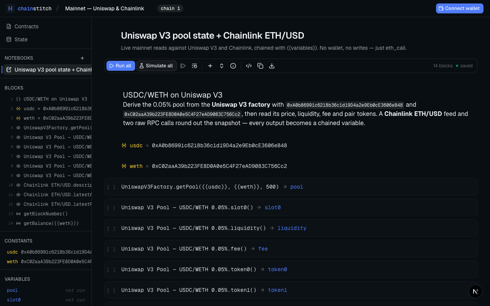
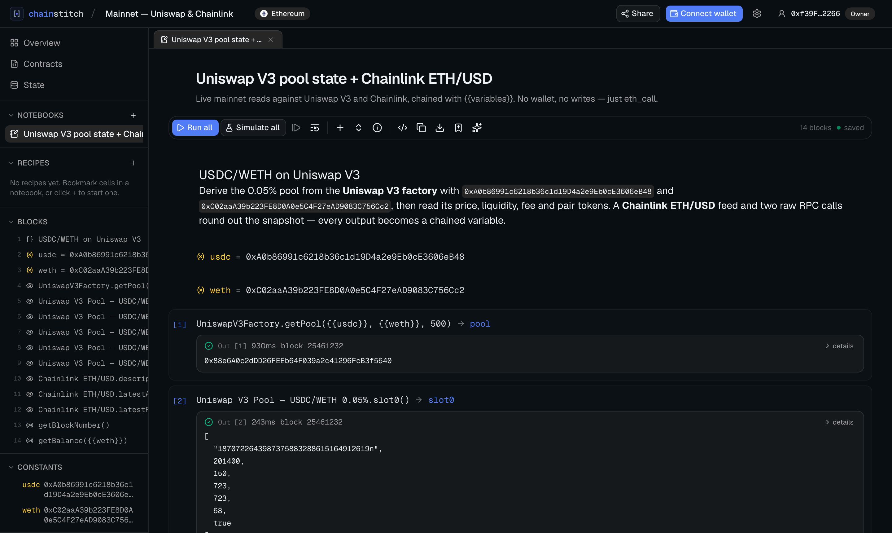
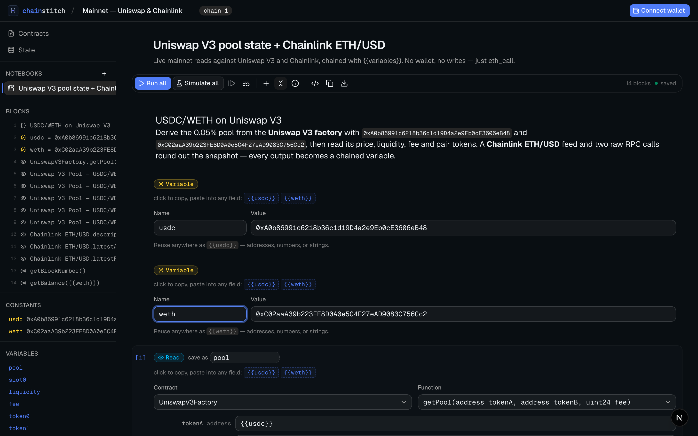
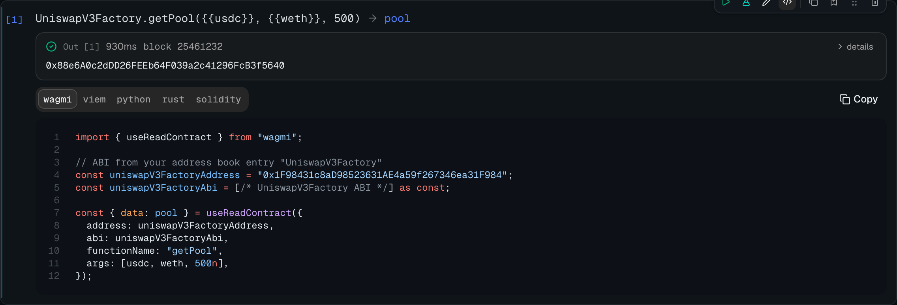
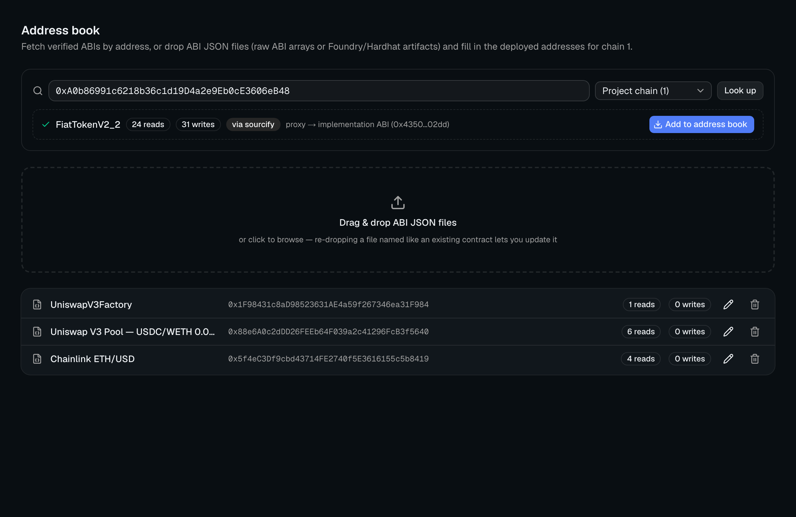
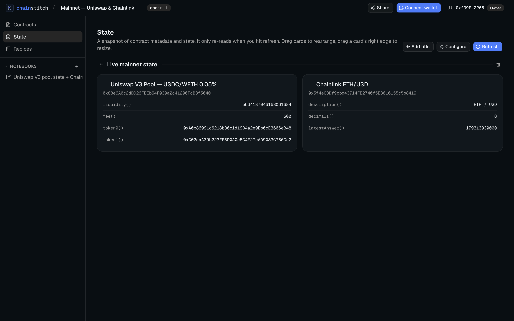
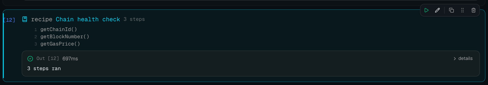
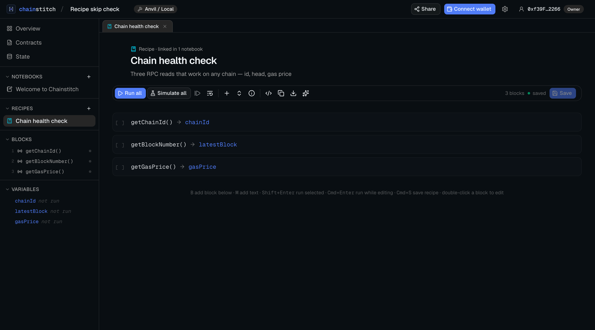
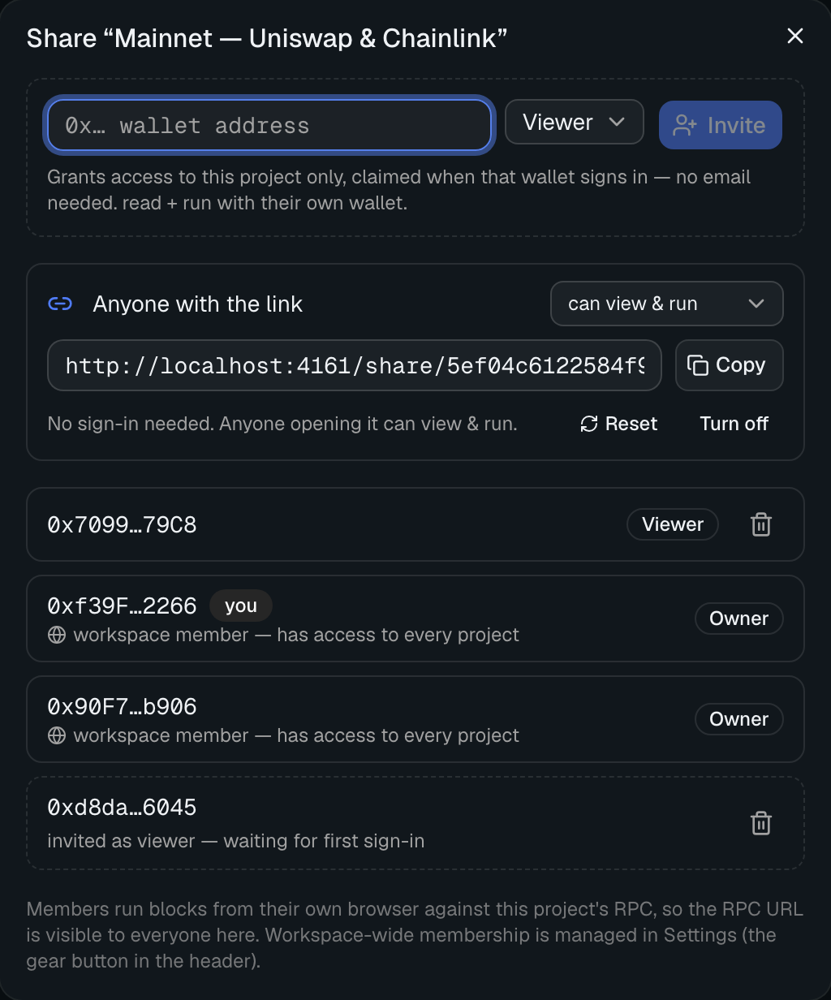
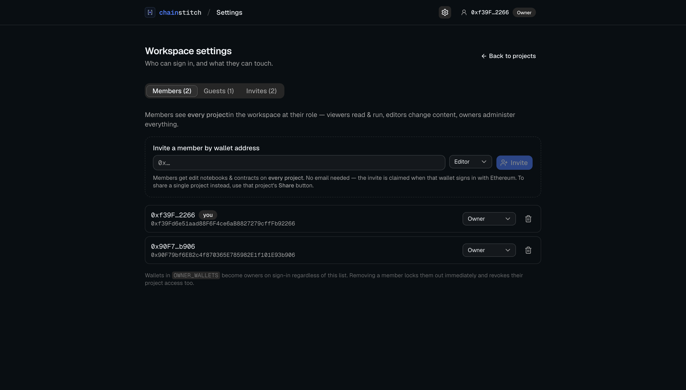

<div align="center">
  <h1>Chainstitch</h1>
  <p><em>Collaborative notebooks for smart contracts — compose, run, and share on-chain calls like Jupyter cells.</em></p>
  <p>
    <a href="LICENSE"></a>
    
    
    
    
    
  </p>
  <p>
    <a href="#features">Features</a> &nbsp;·&nbsp;
    <a href="#quick-start">Quick start</a> &nbsp;·&nbsp;
    <a href="#self-hosting">Self-hosting</a> &nbsp;·&nbsp;
    <a href="#tech-stack">Tech stack</a> &nbsp;·&nbsp;
    <a href="#contributing">Contributing</a>
  </p>
  <br>
  
</div>

Chainstitch is an open-source, local-first collaboration tool for working
with deployed smart contracts. Compose reads, writes, and raw RPC calls into a
notebook, chain them together with `{{variables}}`, and run them cell by cell —
then share the notebook with your team as a single source of truth. Every block
also generates its wagmi/viem source, so a notebook doubles as living, runnable
integration docs.

- **Own everything.** One SQLite file on your machine. No accounts, no
  telemetry, no license server, nothing phones home.
- **Zero setup.** `npm install && npm run dev` — the database creates and
  migrates itself.
- **Share when ready.** Flip on team mode and invite teammates by wallet
  address — sign-in is an Ethereum signature (SIWE), so there's no email server
  to configure and no passwords to manage.

The GIF above is a real recording (no wallet, no writes): it derives the
Uniswap V3 USDC/WETH 0.05% pool from the factory, reads its state, pulls the
Chainlink ETH/USD price, and fires two raw RPC calls — all against Ethereum
mainnet, chained with `{{usdc}}` / `{{weth}}` / `{{pool}}`.

## Features

### Notebooks that chain like Jupyter cells

Ordered blocks, drag to reorder, autosaved, run per-block or top-to-bottom.
Name a block's output and reference it downstream — `{{pool}}`,
`{{receipt.blockNumber}}`, `{{round.answer}}` — with dot/bracket paths into
prior results. Read blocks call view/pure functions; RPC blocks cover
`getBlock`, `getBalance`, `getLogs`, … plus a raw custom-method escape hatch
for anvil cheatcodes.

<p align="center">
  
  <br><sub>Block 1 derives the pool address from <code>UniswapV3Factory.getPool</code>; block 2 reads <code>slot0</code> on that pool — outputs decode and chain forward.</sub>
</p>

### Edit blocks, pipe outputs with `{{variables}}`

Each cell opens to a typed form generated from the ABI. Constants and upstream
outputs surface as one-click `{{chips}}` you can paste into any field, so
multi-step flows (approve → deposit → check balance) stay readable.

<p align="center">
  
  <br><sub>Contract &amp; function selectors from the address book, a <code>{{usdc}}</code> argument, and the output saved as <code>pool</code>.</sub>
</p>

### Readable code, by the block or the whole notebook

Every block deterministically generates a wagmi-hooks or viem snippet; a
notebook-level toggle shows the full runnable source, and the whole notebook
exports as a JSON call manifest. The notebook becomes the integration spec you
hand to the frontend — and it stops drifting because it's the same artifact you
just ran.

<p align="center">
  
  <br><sub>Every block carries its own source toggle — copy-pasteable wagmi, viem, Python, Rust or Solidity, with ABIs from your address book.</sub>
</p>

### Address book

Fetch a verified ABI by pasting an address — Sourcify and Blockscout out of
the box, Etherscan too with a free `ETHERSCAN_API_KEY` — or drag &amp; drop
ABI JSON (raw arrays or Foundry/Hardhat artifacts) and fill in deployed
addresses. Proxies resolve automatically: explorer proxy hints plus an
EIP-1967 slot read pair the proxy address with the implementation ABI (works
on anvil forks — pick the fork's source chain in the lookup). The same
address book feeds every notebook, the codegen, and the State tab — one
source of truth per project.

<p align="center">
  
  <br><sub>Looking up USDC resolves the proxy to its <code>FiatTokenV2_2</code> implementation ABI — one click adds it beside the Uniswap V3 and Chainlink entries, all real mainnet addresses.</sub>
</p>

### State tab

Pin view functions (`name`, `symbol`, `totalSupply`, `slot0`, `latestAnswer`,
…) per contract; they're fetched in one multicall and refreshed on demand.
Drag cards to rearrange, drag an edge to resize, drop in section titles.

<p align="center">
  
  <br><sub>Live mainnet state — pool liquidity/fee/tokens and the Chainlink ETH/USD price, refreshed with one click.</sub>
</p>

### Recipes — save a flow once, rerun it as one cell

Select blocks in any notebook and save them as a named **recipe** — the
classic one is *check the allowance, approve only if it's too low*. Recipes
drop into any notebook from the add-block menu, either as a linked **Recipe
cell** that reruns every step in one click, or pasted as editable blocks
(a linked cell can be “detached” into blocks later). Steps keep full notebook
semantics: they read and write `{{variables}}`, `if` groups and “run when”
guards skip what shouldn't run, and sender groups pick the caller. Recipes
live in the sidebar right below your notebooks and **open in the same
editor**: tweak steps with the full typed forms, test-run them in place, then
hit Save — edits publish explicitly, and every linked cell follows. You can
also start a recipe from scratch there, or overwrite one with a fresh
selection via the bookmark dialog's “Save to” picker.

<p align="center">
  
  <br><sub>A linked “Chain health check” cell: one click reran all three steps — expand <code>details</code> for each step's output, or detach it back into editable blocks.</sub>
</p>

<p align="center">
  
  <br><sub>Recipes open from the sidebar into the same editor as notebooks — tweak steps with the typed forms, test-run in place, then <b>Save</b> to publish to every linked cell.</sub>
</p>

### And more

- **AI import** *(bring your own key)* — paste a Foundry `.t.sol` test file
  and it converts into runnable blocks: `vm.prank` becomes a sender group,
  `vm.deal`/`vm.warp` become anvil cheatcode cells, asserts become condition
  checks — preview, insert, edit. Feed it context for real-world suites:
  drop the imported `.sol` files (base tests, interfaces) and Foundry
  artifacts (`out/**/*.json` — missing contracts are added to the address
  book on insert), pick which test functions to convert, and run the
  one-request pre-flight check to see what's missing before converting.
  Uses Google AI Studio's free tier (~1,500 requests/day, no card); calls go
  straight from your browser to Google, and the key never touches the
  Chainstitch server.
- **Document tabs & project overview** — notebooks and recipes open in
  browser-style tabs above the editor: switch with a click, close with the ✕
  or a middle-click, drag to reorder, and the open set persists per project
  in your browser. Each project's **Overview** page is the explorer for its
  notebooks, recipes, contracts and state dashboard.
- **In-app docs** — `/docs` walks through usage, anvil workflows and
  self-hosting, right inside the app (public on team-mode instances).
- **Write blocks simulate first** — revert reasons surface *before* the wallet
  prompt — then send and await the receipt.
- **Simulate as anyone** — dry-run entire notebooks as any address via
  `eth_call`; on anvil forks, impersonated writes need no keys at all.
- **Text** blocks (markdown), **variable** blocks (named constants), and
  **sender groups** (run child blocks as a chosen caller).
- **Condition blocks** — an `if` group runs its blocks only when a condition
  on prior outputs holds (`{{allowance}} < {{amount}}` → approve only when
  needed); a per-block "run when" guard does the same for single cells.
- **Team workspaces** *(optional)* — Sign-In with Ethereum, invite-only access
  by wallet address, viewer / editor / owner roles. Share the whole workspace
  from Settings, or a single project from its Google-Docs-style **Share**
  button.

## Quick start

```bash
npm install
npm run dev
```

Open http://localhost:3000 and create a project (there's an Anvil preset).
Every new project starts with a **Welcome notebook** — a runnable tour of
blocks, variables, conditions and recipes that works against any RPC, no
contracts or wallet needed. When you're done with it, drop your ABIs in the
Contracts tab, start your own notebook, and delete the tour.

Wallet connect uses injected wallets (MetaMask, Rabby, …) out of the box. For
WalletConnect (QR / mobile), set `NEXT_PUBLIC_WALLETCONNECT_PROJECT_ID` in
`.env.local` (see `.env.example`). Reads work with no wallet connected — point
a project at any Ethereum RPC and start with `eth_call`.

### Local chain workflow

```bash
anvil                  # plain local chain
anvil --fork-url $RPC  # fork mainnet/testnet state
```

Point your project at `http://127.0.0.1:8545` (chain id 31337). The custom RPC
block drives anvil cheatcodes (`anvil_setBalance`,
`anvil_impersonateAccount`, `evm_snapshot`, `evm_revert`), and sender groups
can impersonate whales on forks without touching a private key.

## Self-hosting

Chainstitch runs in one of two modes — same codebase, same database, one
environment variable apart:

| | `local` (default) | `team` |
| --- | --- | --- |
| Sign-in | none | Sign-In with Ethereum (SIWE) |
| Who gets in | whoever can reach the port | invited wallets only |
| Sharing | — | invite by wallet address, with roles |
| Best for | your laptop, trusted networks | a team instance on a server |

### From clone to team, start to finish

1. **Get a box and a name.** Any small VPS works. Point a DNS record (say
   `notebook.example.com`) at it and clone the repo there.
2. **Terminate TLS in front.** Sessions and wallet sign-in are domain-bound,
   so serve HTTPS. With Caddy that's the whole config:

```
notebook.example.com {
    reverse_proxy localhost:3000
}
```

3. **Configure team mode.** `cp .env.example .env` and set the four
   variables below. `APP_URL` must be the *exact* URL the team will type.
4. **Start it.** `docker compose up -d --build` (compose picks up `.env`) —
   or see [Deploy with Node](#deploy-with-node).
5. **Sign in and share.** Open the domain, sign in with an `OWNER_WALLETS`
   wallet, and hand out access at whichever radius fits: the whole workspace
   (**Settings** → invite by wallet + role), a single project (its **Share**
   button), or an **anyone-with-the-link** URL for view/edit access with no
   account at all. Teammates just open the site and sign with their wallet —
   invites are claimed on first sign-in, no email involved.

### Team mode in four variables

```bash
APP_MODE=team
OWNER_WALLETS=0xYourAddress                    # comma-separated owners
BETTER_AUTH_SECRET=$(openssl rand -base64 32)  # session signing key
APP_URL=https://notebook.example.com           # exact URL users visit
```

Start the app, sign in with an owner wallet, then invite teammates from
**Settings** (the gear button in the header) — an invite is just a wallet
address and a role, claimed automatically the first time that wallet signs
in. The sign-in signature is domain-bound to `APP_URL`, costs nothing, and
never touches a chain — it's identity only. Roles:

| Role | Can do |
| --- | --- |
| viewer | read everything, run blocks with their own wallet |
| editor | + edit contracts, notebooks, blocks, state views |
| owner | + project settings & RPC URLs, members & invites, deletes |

An invite grants the whole workspace by default, but can be scoped to a
**single project** instead — pick a scope in Settings, or use the **Share**
button in any project's header (Google-Docs style: wallet + role, see who has
access, revoke). A project-scoped wallet gets that role on that project only
and sees nothing else — handy for auditors or outside collaborators — and
project owners can share their own project onward without any workspace-wide
rights. For existing members a project grant can raise (never lower) their
role on that one project. Note that project access includes the project's RPC
URL, since blocks execute in the member's browser.

The Share dialog can also turn on **“anyone with the link”**: a secret URL
that opens that one project without any sign-in, as viewer (view & run) or
editor — wallets never see it, reads still run from the visitor's browser.
Resetting the link invalidates every copy that was handed out; turning it off
does so instantly. Owner rights are never grantable by link.

<p align="center">
  
  <br><sub>Every project has a Share dialog: invite by wallet, choose a role, see who has access (and why), revoke in one click.</sub>
</p>

<p align="center">
  
  <br><sub>Workspace-wide access lives in <b>Settings</b> — members, roles, per-project grants and pending invites in one place.</sub>
</p>

Switching an existing local instance to team mode keeps all your projects; they
become the shared workspace, owned by `OWNER_WALLETS` after first sign-in.
Switching back (`APP_MODE=local`) bypasses auth again — only do that on a
machine you trust end-to-end.

### Deploy with Node

```bash
npm ci && npm run build
APP_MODE=team OWNER_WALLETS=0x… BETTER_AUTH_SECRET=… APP_URL=https://… \
  npm start          # serves on :3000
```

### Deploy with Docker

```bash
docker build -t chainstitch .
docker run -d --name chainstitch -p 3000:3000 \
  -v ./data:/app/data \
  -e APP_MODE=team \
  -e OWNER_WALLETS=0xYourAddress \
  -e BETTER_AUTH_SECRET=change-me \
  -e APP_URL=https://notebook.example.com \
  chainstitch
```

If you keep the variables in a `.env` file (copy `.env.example`), replace the
`-e` flags with `--env-file .env` — plain `docker run` does **not** read
`.env` by itself. To apply a rebuild or config change, remove the old
container first, then run again: `docker rm -f chainstitch` (your data
survives — it lives in the mounted `data/` directory).

Or use the included `docker-compose.yml`, which reads the same variables from
a `.env` file automatically: `docker compose up -d --build`. All state lives
in the mounted `data/` directory. One caveat: `NEXT_PUBLIC_WALLETCONNECT_PROJECT_ID` is
inlined at **build** time (Next.js public-env semantics), so it must be set
when the image is built — passing it at `docker run` has no effect. Injected
browser wallets work without it.

### Production notes

- Put a reverse proxy (Caddy, nginx, Traefik) in front for TLS — sessions are
  httpOnly cookies (marked `Secure` over HTTPS) and SIWE messages are
  domain-bound to `APP_URL`, which must be the exact URL users visit.
- Signed-out visitors on a team-mode instance see a landing page at `/`,
  and `/docs` is public too (all other app routes stay login-gated).
  Optional env vars wire the landing buttons: `DEMO_SHARE_URL` (a project's
  "anyone with the link" URL for the Try-the-demo button) and `GITHUB_URL`
  (defaults to the Chainstitch repo) — both read at request time, no
  rebuild needed.
- Never expose a `local`-mode instance to the internet; it has no auth by
  design. Use `team` mode for anything reachable by others.
- Removing a member locks them out immediately; they can't sign back in unless
  re-invited or listed in `OWNER_WALLETS`.

### Operations

- **Backups** — everything is one SQLite file. Safe while running:
  `sqlite3 data/chainstitch.db ".backup data/backup-$(date +%F).db"`. If you copy
  the raw file instead, stop the app first or include the `-wal`/`-shm` files
  (WAL mode is on).
- **Upgrades** — pull, build, restart (or pull the new image). Schema
  migrations apply automatically on boot; there is never a manual migration
  step.
- **Database location** — override with `CHAINSTITCH_DB_PATH=/path/to/file.db`
  (default: `data/chainstitch.db`).

## Privacy by construction

Private keys never touch the server: writes are signed in the browser wallet,
and reads/RPC calls execute client-side against your project's RPC. The server
stores notebook *definitions* — never execution results (run outputs persist
client-side and in the workspace's notebook run-state). RPC URLs are visible to
workspace members whose browsers execute against them, so use rate-limited or
public keys for shared projects.

## Tech stack

| Layer | Tech |
| --- | --- |
| Framework | [Next.js](https://nextjs.org) (App Router, TypeScript) — API routes are the whole backend |
| Ethereum | [viem](https://viem.sh) + [wagmi](https://wagmi.sh) v2 · [RainbowKit](https://rainbowkit.com) for wallet connect |
| Auth (team mode) | [Better Auth](https://better-auth.com) with its SIWE plugin (ERC-4361), verified via viem |
| Database | SQLite via [Drizzle ORM](https://orm.drizzle.team) + better-sqlite3 — zero-config, auto-migrating |
| UI | Tailwind CSS v4 · shadcn/ui · dnd-kit (reordering) · shiki (code highlighting) |
| State / data | Zustand (notebook editor) · TanStack Query (server state) |

## Tests

```bash
npm run smoke        # execution engine against a running anvil node
npm run test:authz   # role & workspace isolation rules (temp database)
npm run test:team    # end-to-end SIWE login/invite/role flow (own server)
```

`smoke` deploys a Counter contract and exercises the engine, variable
interpolation, RPC blocks, and codegen. The other two spin up their own
throwaway databases and never touch your data.

## Contributing

Issues and PRs are welcome — see [CONTRIBUTING.md](CONTRIBUTING.md) for setup,
the code map, and the project invariants. Before opening a PR, make sure
`npm run lint`, `npm run test:authz`, and `npm run test:team` pass
(`npm run smoke` too if you touched the execution engine — it needs a local
anvil). Security reports go through [SECURITY.md](SECURITY.md), never public
issues.

## License

[MIT](LICENSE)
